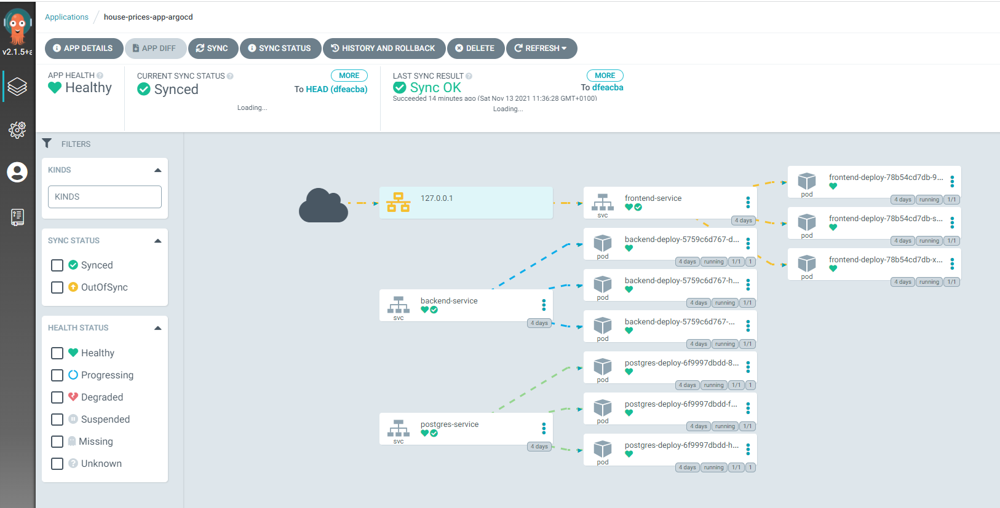

# Python-Microservices-Web-App

The following gif shows how the app works:


## Usage

1. **Clone** this repository

```bash
git clone https://github.com/jmonsalverodilla/Python-Microservices-Web-App.git
cd Python-Microservices-Web-App
```

2. Run **docker-compose** to run it locally

```bash
docker-compose up --build
```
The app will be running at the following address: http:\\localhost:8080


For a production deployment, instead of **docker-compose** which runs on a single node, **kubernetes** should be used.
The following diagram shows the different components that make part of kubernetes.



## License

This repo is under the [MIT License](LICENSE).